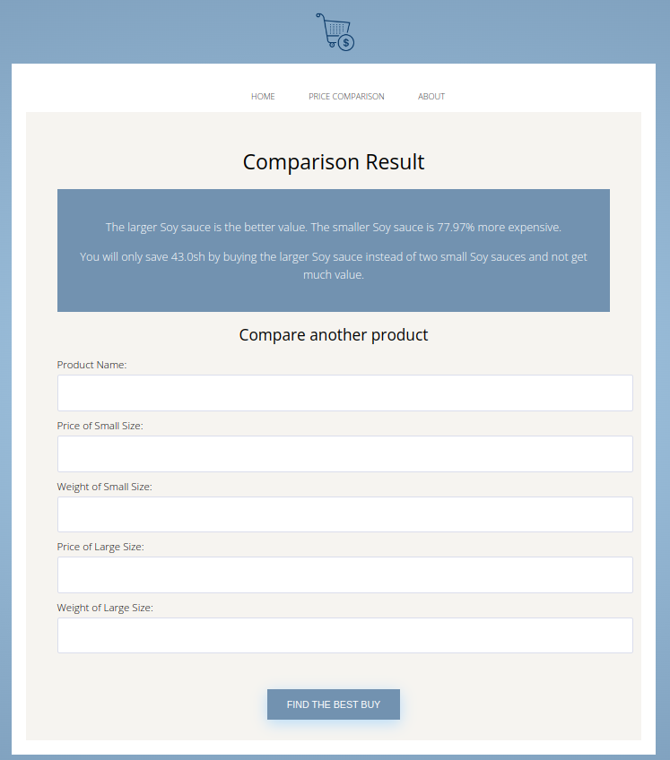

# Best Buy 

### Make shopping decisions with confidence

Making purchase decisions while shopping can be overwhelming and time-consuming, with so many options and prices to choose from. That's why I created **Best Buy App** to make it easier for you to determine which product offers the most value and make smart shopping decisions.


## Preview




### General Overview

With Best Buy App, you can compare the prices of different sizes of the same product and see which one offers the most value based on weight and cost. Simply enter the price and weight of the small and large sizes, and the app do the rest. It will even tell you if it's worth spending more money on the larger item, or if you're better off sticking with the smaller size.

### Getting Started

_To get a local copy up and running follow these simple steps._

1. Clone the repo
   ```
   git clone https://github.com/Benmuiruri/best-buy-app.git
   ```
2. Goto project directory
   ```
   cd best-buy-app
   ```
3. Install dependencies
   ```
   bundle install
   ```
4. Run app
   ```
   bundle exec rerun app.rb
   ```

### Testing

`bundle exec rake test` will run all the tests.


👤 **Ben**

- GitHub: [Ben Kiarie](https://github.com/Benmuiruri) - Follow me on Github, browse my projects, and leave a star for any project you like.
- Twitter: [Optimize](https://twitter.com/_optimize) - Follow me on Twitter I will make your Timeline a bit more interesting
- LinkedIn: [Ben Kiarie](https://www.linkedin.com/in/benjamin-kiarie-180b66149/) - Connect with me on LinkedIn lets expand our network for mutual benefits.

### 🤝 Contributing

Contributions, issues, and feature requests are welcome!

### Show your support

Give a ⭐️ if you like this project!

### 📝 License and Intellectual Property

Copyright (c) 2023 Ben Kiarie (ben.muiruri13@gmail.com) Released under the MIT licence.
